# Уровни
Система уровней на сервере, предназначенная для прокачки как личного состояня игрока, так и для прокачки поселений. 
Участие в рейтинговой борьбе как личной так и командной.

---

## Уровни игрока
Максимальный уровень который может получить игрок это **100**.
Игрок может учавствовать в квестах для получения опыта который в свою очередь преобразуется в уровни игрока.
Полну информацию об уровне можно получить в меню прописав команду `/уровень`. 

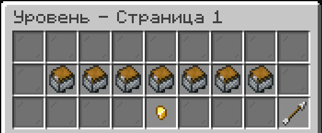

Вам откроется меню со всем уровнями и наградами за последующий вы можете просмотреть абсолютно все узнав требования и получаемы награды.
Так же вы можете просмотреть количество опыта до следующего уровня

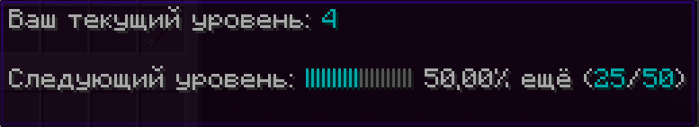

### Префиксы
Существуют так же префиксы для обозначения уровня, это иконки домика `☖ <текущий уровень>`, цвет этих домиков меняется каждые **10** уровней, а на **100** становится жирным цветом, вот таблица для наглядности:

| Цвет домика                     | Диапазон уровней |
|---------------------------------|------------------|
| 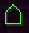   | 1-10             |
| 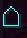   | 11-20            |
| 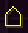   | 21-30            |
| 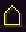   | 31-40            |
| 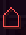   | 41-50            |
| 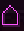   | 51-60            |
| 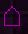   | 61-70            |
| 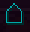   | 71-80            |
| 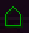   | 81-90            |
| 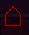 | 91-100           |
| 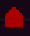 | 100              |

## Как отображается в чате
Так же префиксы уровня игрока отображаются и в чате перед городом
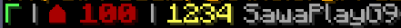

## Уровни города
Уровни города сильно похожи по механике на уровни игрока они так же используют опыт для получения всё более высоких уровней. Всего городских уровней **30**, получать их можно совместно что делает кооперативную игру более простой, в отличие от игроков-одиночек. Пока что уровни города можно зарабатывать только выполняя квесты города.

Что бы открыть меню городских уровней используйте `/уровень_город`.

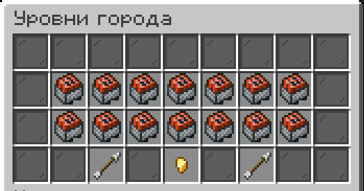

Так же как и в уровнях игрока вы можете просмотреть прогресс уровня своего города

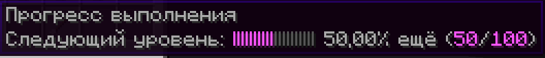

Так же напомню что при удалении города удаляется и весь его прогресс, эта статистика никак не возобновляется.

### Префиксы
Префиксы так же присуще и городским уровням, они схожи с механикой уровней игрока, но имеют иконку `◇`, а так же для последнего уровня `◆`, меняются каждые **10** уровней вот как они выглядят:

| Цвет ромба                    | Диапазон уровней |
|-------------------------------|------------------|
| 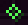   | 1-10             |
| 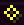   | 11-20            |
| 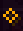   | 21-29            |
| 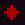   | 30               |

### Как отображается в табе
Так же уровни города имеют отображения в `TAB` перед профессией игрока внутри города

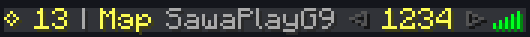